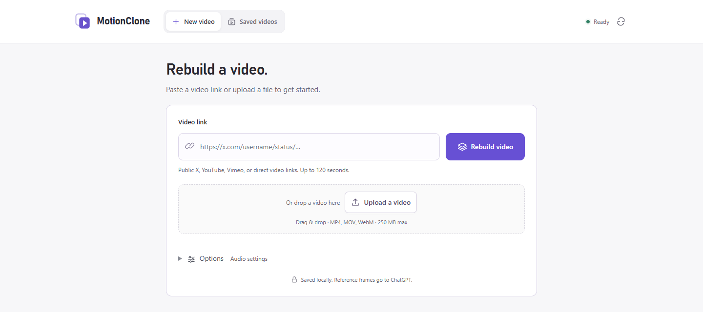
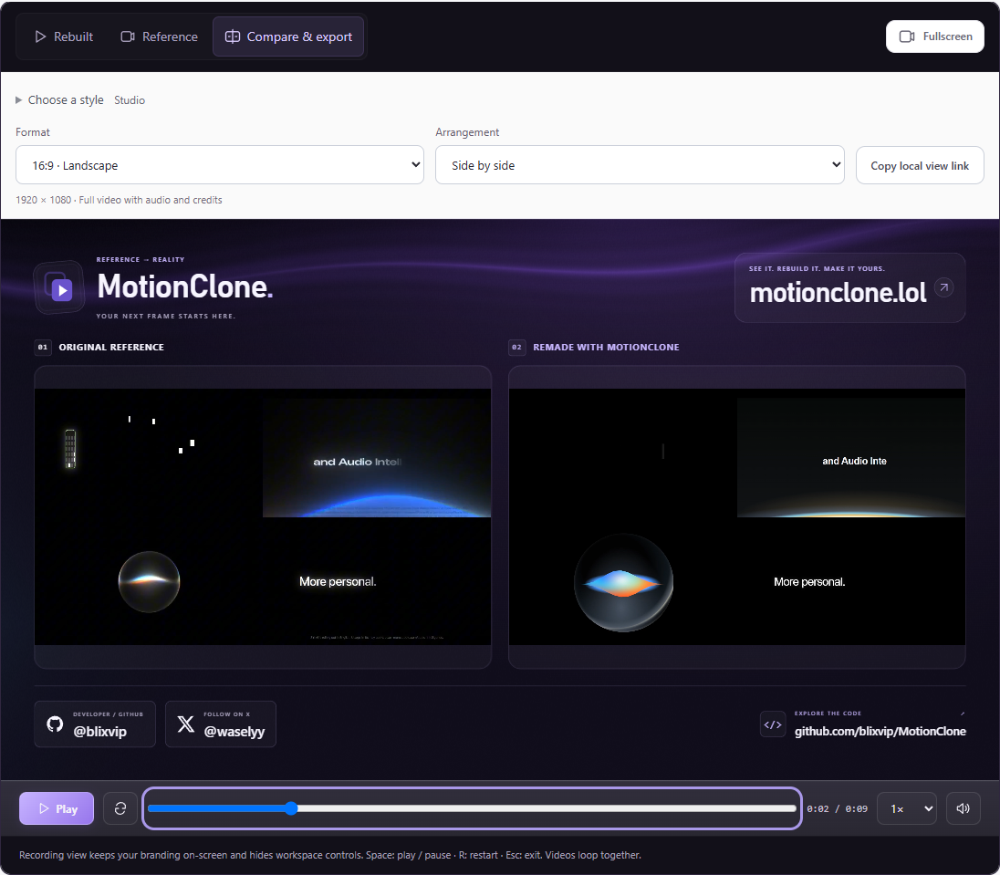

<p align="center"></p>
<p align="center"><strong>Turn a reference video into an editable motion project.</strong></p>
<p align="center"><a href="#run-locally">Get started</a> · <a href="docs/RECORDING.md">Recording & exports</a> · <a href="docs/DEVELOPMENT.md">Development</a></p>

MotionClone is a local Windows app that uses your ChatGPT login to rebuild a video's text, shapes, artwork, and animation as editable HyperFrames layers. Paste a public video link or upload a file, compare the reconstruction with the original, then download a video or editable project.



## What you get

- **Editable layers:** generated text, CSS, SVG, and animation code in a HyperFrames project.
- **Original vs. rebuilt playback:** synchronized play, pause, seeking, and audio to inspect differences.
- **Ready-to-share comparisons:** six recording looks, three canvas formats, and three video arrangements.
- **A local library:** reopen saved videos, search, favorite, collect, and archive projects.

**Reconstruction is approximate.** Small text, photographs, unknown fonts, complex footage, and 3D can differ significantly. Review the comparison before using the result. A completed export does not mean a perfect match.

## Run locally

Install these first:

| Requirement | Used for |
| --- | --- |
| Windows | Supported launcher and local workflow |
| Git | Cloning this repository |
| Python 3.11+ | Local app and media pipeline |
| Node.js 22+ and npm | HyperFrames rendering |
| FFmpeg and ffprobe | Reading and encoding video |
| Google Chrome | Browser rendering and checks |
| Official Codex CLI with a ChatGPT login | AI analysis and reconstruction |

Make `git`, `python`, `npm`, `ffmpeg`, `ffprobe`, and `codex` available on PATH. Then run in PowerShell:

```powershell
git clone https://github.com/blixvip/MotionClone.git
cd MotionClone
codex login
.\start.ps1
```

The launcher installs the locked Python and HyperFrames dependencies, starts the server, and opens **http://127.0.0.1:4319**. First launch needs an internet connection. Later, run `start.ps1` again or double-click **Start MotionClone.vbs**.

**No API key required.** AI work uses your existing Codex login and account access. The default model is `gpt-6-astra`. To choose another model available to your account, set `$env:FRAMEFORGE_MODEL = "YOUR_MODEL_NAME"` before launching. The `FRAMEFORGE_` name is retained for compatibility.

## Rebuild your first video

1. **Add a reference.** Paste a public HTTPS link from X / Twitter, YouTube, Vimeo, or a direct video URL. You can also upload a file. Open **Options** to change the original-audio setting.
2. **Select Rebuild video.** The progress view shows the current stage. Completed scenes are saved for retries.
3. **Review the result.** Switch between **Rebuilt**, **Reference**, and **Compare & export**. The comparison plays both videos together.
4. **Download.** Choose a comparison MP4, editable project, or rebuilt-only video using the options below.
5. **Return later.** Open **Saved videos** to find and organize your projects.



*Real saved reconstruction; differences between the two videos remain visible.*

## Choose the right download

| You want | Use | You receive |
| --- | --- | --- |
| A branded original/rebuilt comparison | **Compare & export**, choose the style, format, and arrangement, then **Download MP4** | The full comparison video, including original audio when retained |
| Editable text, shapes, and animation | **Editable project** | A HyperFrames ZIP with project code and required assets |
| Only the reconstructed video | **Export details → Rebuilt video only** | The unframed rebuild |

In **Compare & export**, expand **Choose a style** for Studio, Editorial, Signal, Cobalt, Peach, or Monochrome. Formats are landscape (1920 × 1080), portrait (1080 × 1920), and square (1080 × 1080).


To edit a HyperFrames ZIP, extract it, run `npm install`, then `npm run preview`. Follow the ZIP's README: generated scenes use `project.json` plus `npm run sync`; authored scenes use `scene-*.js` and `tokens.css`. Run `npm run render` to create a video. Source video and reference screenshots are excluded from this ZIP. A full archive includes the original reference and app code.

See [Recording and exports](docs/RECORDING.md) for fullscreen controls, saved local view links, export behavior, and legacy projects.

## Limits and data

- Inputs: **120 seconds, 250 MB, up to 4K and 240 fps**. HDR becomes SDR; variable frame timing is normalized.
- Analysis and correction share an eight-minute budget. Downloading, rendering, and encoding take additional time. Failed rebuilds are not replaced with the original video.
- Projects and media stay in `data/` on your computer. **Selected reference frames go to ChatGPT** for analysis; source downloads contact the video service. This is not an offline-only app.
- Screenshots show saved examples. Reference videos and completed projects are not bundled with a fresh clone.

## Troubleshooting

| Problem | Next step |
| --- | --- |
| A command is not found | Install the matching prerequisite, add it to PATH, and reopen PowerShell |
| The app asks you to connect ChatGPT | Run `codex login`, then refresh the connection in the app |
| A link cannot be downloaded | Upload the video file instead; private or unavailable links may fail |
| The server does not start | Check `server-error.log` in the project folder |
| The result looks different | Inspect both videos in Compare & export; reconstruction fidelity varies |

## Development and support

After setup, run `.venv\Scripts\python.exe -m pytest -q` for the Python tests. See [Development and verification](docs/DEVELOPMENT.md) for browser checks, screenshot capture, project layout, and the optional showcase at `/?demo=1`.

Report reproducible problems in [GitHub Issues](https://github.com/blixvip/MotionClone/issues). Include the steps and relevant error text; remove private project details.

See [THIRD_PARTY.md](THIRD_PARTY.md) and [licenses/](licenses/) for attribution. **No project-wide open-source license has been assigned.**

<a href="https://buymeacoffee.com/blix"></a>
