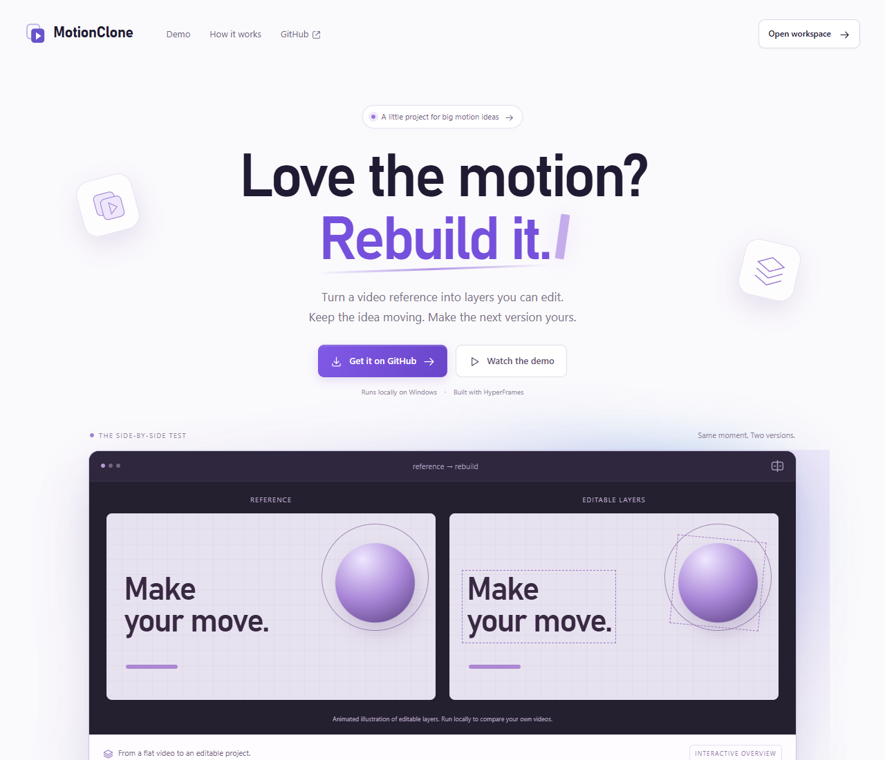

<p align="center"></p>
<p align="center">Turn a reference video into an editable motion project.</p>
<p align="center"><a href="https://buymeacoffee.com/blix"></a></p>



MotionClone is a local Windows app for creators who want to rebuild a video's text, shapes, artwork, and animation as editable HyperFrames layers. Paste a public X / Twitter, YouTube, Vimeo, or direct video URL, or upload a file. No branding input is required.

## What it does

- Scans every source frame and sends selected timestamped frames to ChatGPT for scene analysis.
- Authors independent text, CSS, and SVG layers; checks previews and attempts bounded visual corrections.
- Saves completed scenes so retries can resume, and reuses unchanged verified exports.
- Compares every rendered frame and offers synchronized original/rebuilt playback.
- Plays original and rebuilt videos side by side in the home screen and library, with shared pause, seeking, and optional original audio. Visible previews autoplay muted; reduced-motion settings disable autoplay.
- Exports an MP4 and an editable HyperFrames project. Saved videos support search, favorites, collections, and archiving.

**Reconstruction is approximate.** Complex footage, small text, photographs, unknown fonts, and 3D can differ significantly. Processing time depends on the video and model; there is no universal fidelity or runtime guarantee. A successful export is not proof of a perfect visual match.

## Run locally

Requirements: Windows, Python 3.11+, Node.js 22+, FFmpeg/ffprobe, Google Chrome, and the official Codex CLI with a ChatGPT login. Make `python`, `npm`, `ffmpeg`, `ffprobe`, and `codex` available on PATH.

```powershell
git clone https://github.com/blixvip/MotionClone.git
cd MotionClone
codex login
.\start.ps1
```

The launcher creates the Python environment, installs locked Python and HyperFrames dependencies, starts the local server, and opens **http://127.0.0.1:4319**. You can also double-click **Start MotionClone.vbs**. It runs the server in the background and does not close existing terminals.

Codex is separately installed. This app uses its existing login and does not require an API key. Default analysis model: `gpt-6-astra`; set `FRAMEFORGE_MODEL` before launching to use another model available to your account. The historical environment-variable name is retained for compatibility.

## Use

1. Select **Open workspace** from the demo homepage. Paste a video URL or upload a file. Optionally disable original audio.
2. Select **Rebuild video**. Completed scenes are saved; the progress view shows the current stage and elapsed time.
3. Review **Rebuilt**, **Reference**, and **Compare**. Remaining visual differences are labeled.
4. Download the MP4 or **Editable project**. Full archives and verification details are under **Export details**.

Inputs are limited to 120 seconds, 250 MB, 4K, and 240 fps. HDR is tone-mapped to SDR and variable frame timing is normalized. Private or unavailable links may require uploading the file. Analysis/correction has an eight-minute budget; rendering and encoding take additional time. No failed rebuild is replaced by the original video.

## Editable exports

The HyperFrames ZIP contains composition data/code, required local assets, fonts/audio, and verification. Source video and reference screenshots are excluded. Extract it, run `npm install`, then `npm run preview` or `npm run render`. For generated projects, edit `project.json` and run `npm run sync` before external tooling reads `project.js`.

A **full archive** also includes the original reference and app code for local comparison. Keep that distinction in mind when sharing an archive.

New jobs use HyperFrames. Legacy projects retain their original exporters and are labeled accordingly; optional legacy Remotion rendering requires `npm ci --prefix remotion`.

## Local data and privacy

Projects are stored in `data/` on your computer. Selected reference frames go to ChatGPT for analysis. Source downloads contact the relevant video service. Interface icons and support-button artwork load locally; the Buy Me a Coffee link opens its website only when clicked.

The repository excludes user projects, media, logs, environment files, dependencies, and generated test outputs. Existing internal storage/authentication identifiers remain compatible with older Frameforge installations.

## Project showcase

The homepage is a GitHub project showcase with a live local comparison, a short walkthrough, setup instructions, and support links. The application remains at `/?workspace=1`; existing project links still work.

Build a portable static version with `python scripts/build_showcase.py`. Serve the generated `site/` folder on a static host. It contains only the landing page, original illustrative animation, and interface assets—no saved projects or reference media. Away from the local server, the page labels its animation as an illustration and links visitors to setup instructions. Test the local landing page with `scripts/showcase_acceptance.py`.

## Checks

After setup, with the local app running:

```powershell
.venv\Scripts\python.exe -m pytest -q
.venv\Scripts\python.exe scripts/light_ui_acceptance.py
.venv\Scripts\python.exe scripts/final_ui_acceptance.py
```

The browser checks use isolated fixtures and do not start real AI work. To inspect an existing completed HyperFrames rebuild, use `scripts/hyperframes_acceptance.py --project YOUR_PROJECT_ID`. `scripts/generalized_acceptance.py --run-ai` is an optional real-model benchmark that uses your connected ChatGPT plan.

With at least one completed source/rebuild pair saved, `scripts/live_preview_acceptance.py` checks real synchronized playback, seeking, mobile layouts, reduced motion, and the WebGL fallback without changing the project. The localized light effect uses original GLSL with a static CSS fallback and stops drawing offscreen.

## Assets and credits

The interface includes 41 original SVG icons, six state illustrations, and MotionClone logo variants. `scripts/build_brand.py` regenerates the SVG sources. The official Buy Me a Coffee button links to [blix](https://buymeacoffee.com/blix).

See [THIRD_PARTY.md](THIRD_PARTY.md) and `licenses/` for attribution and dependency notices. Third-party artwork and fonts retain their respective terms. No project-wide open-source license has been assigned.
