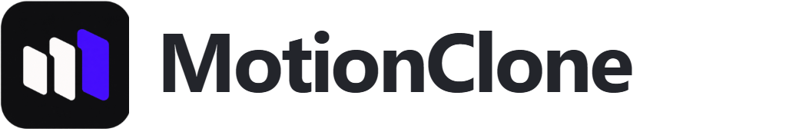
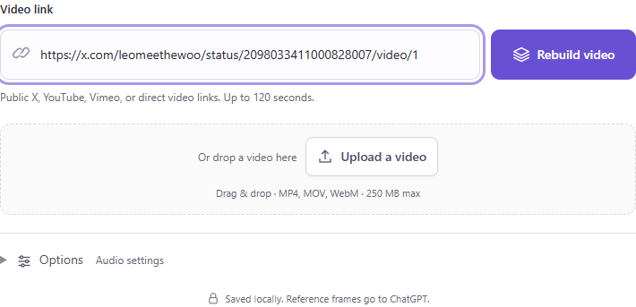
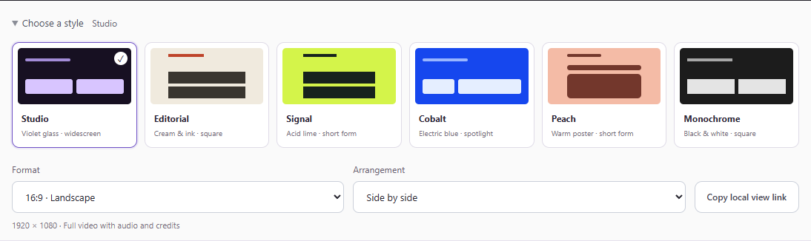
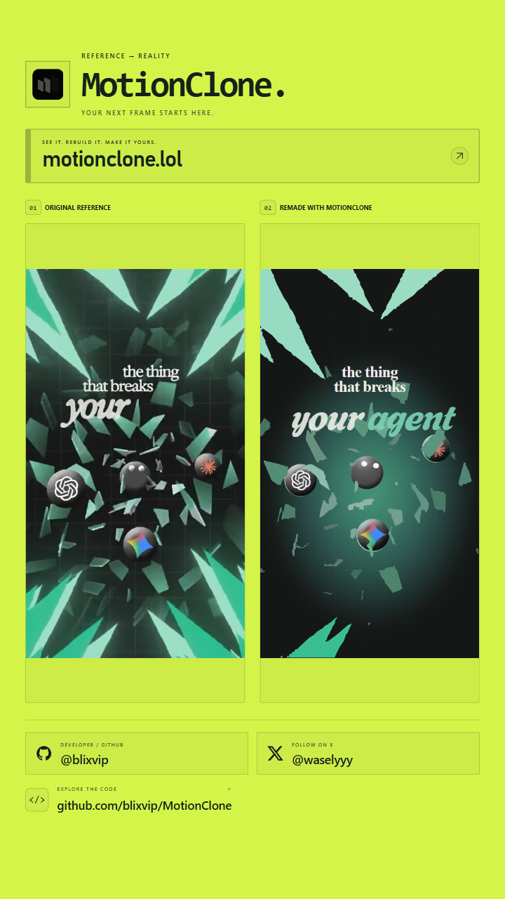
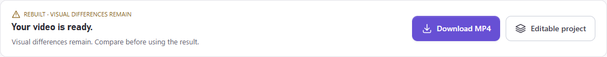
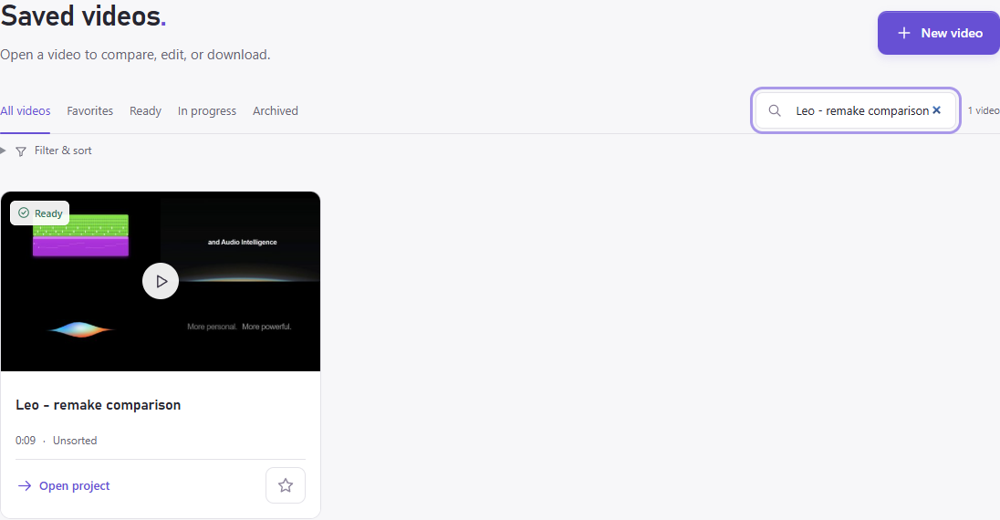

**English** | [简体中文](README.zh-CN.md)

<p align="center">
  <picture>
    <source media="(prefers-color-scheme: dark)" srcset="docs/images/motionclone-wordmark-light.png">
    
  </picture>
</p>

# MotionClone: AI motion graphics from a reference

Give MotionClone a reference video. It uses Codex and your ChatGPT account to rebuild the text, shapes, artwork, and animation as an **editable HyperFrames project**. Change the copy, adjust the timing, and use the graphics in a product demo or launch video.

<p>
  <a href="https://motionclone.lol">Try the online studio</a> ·
  <a href="#run-locally">Run locally on Windows</a> ·
  <a href="docs/AGENT-WORKFLOW.md">Use with a coding agent</a>
</p>

<a href="https://buymeacoffee.com/blix"></a>

[](https://motionclone.lol/#examples)

*An actual saved reconstruction. Original on the left, MotionClone on the right. [Watch with playback controls](https://motionclone.lol/#examples) · [View a still](docs/images/hero-comparison.png)*

The local app is free to download and has no MotionClone subscription. **ChatGPT/Codex account costs and usage limits are separate.** Reconstruction is approximate: small text, unfamiliar fonts, photographs, and complex 3D can need more work.

## Run locally

The walkthrough below uses the Windows app. The [online studio](https://motionclone.lol) is also in early access; it requires sign-in, a separate ChatGPT connection, and an available processing worker.

Have these installed before running the launcher:

| Requirement | What it does |
| --- | --- |
| Windows, Git, Python 3.11+ | Runs the local app |
| Node.js 22+ and npm | Runs HyperFrames |
| FFmpeg and ffprobe | Reads and exports video |
| Google Chrome | Renders the animation |
| Official Codex CLI with ChatGPT account access | Analyzes and reconstructs the reference |

Make `git`, `python`, `npm`, `ffmpeg`, `ffprobe`, and `codex` available on PATH. In PowerShell:

```powershell
git clone https://github.com/blixvip/MotionClone.git
cd MotionClone
codex login
.\start.ps1
```

The launcher installs the locked dependencies and opens **http://127.0.0.1:4319**. First launch needs an internet connection. Next time, run `start.ps1` or double-click **Start MotionClone.vbs**.

No API key is required. MotionClone uses your Codex login. For a different model available to your account, set `FRAMEFORGE_MODEL` before starting the app; the older environment-variable name is kept for compatibility.

## 1. Add your reference

Paste a public link from X / Twitter, YouTube, Vimeo, or a direct video URL. You can also drag in a file or choose **Upload a video**. Open **Options** to choose whether to keep the original audio.



Start with a short clip whose typography and movement are easy to read. Use footage you own or have permission to adapt. Local inputs can be up to **120 seconds and 250 MB**.

## 2. Rebuild the motion

Click **Rebuild video**. MotionClone analyzes reference frames, builds the animation, and renders the result. The progress view shows the current stage; completed scenes are saved for retries.

When it finishes, your rebuilt video appears with its download options:


This is a saved result. Downloading, AI analysis, rendering, and encoding each take time. Failed rebuilds report an error; the original video is never substituted for a failed reconstruction.

## 3. Check it against the original

Open **Compare & export**. Play both videos together, scrub to a specific moment, or slow down playback. Check the words, shapes, spacing, and transitions before using the result.


The **Rebuilt** and **Reference** tabs let you inspect either video on its own. A successful export means a file was produced; the comparison tells you how closely the motion matches.

## 4. Choose how to present it

Expand **Choose a style**. Pick Studio, Editorial, Signal, Cobalt, Peach, or Monochrome, then choose the **Format** and **Arrangement** separately.



Comparison exports support landscape **1920 × 1080**, portrait **1080 × 1920**, and square **1080 × 1080**. Use side-by-side, stacked, or rebuild-spotlight arrangements. **Fullscreen** opens the recording view.

<p align="center">
  
</p>

*The System Prompts example in a portrait comparison. Both the source and reconstructed animation remain visible.*

## 5. Download a video or keep editing



| If you want… | Choose… |
| --- | --- |
| The complete original/rebuilt comparison | **Compare & export → Download MP4** |
| Only the reconstructed animation | **Export details → Rebuilt video only** |
| Text, shapes, assets, and animation code to edit | **Editable project** |

The comparison MP4 uses the selected style, format, and arrangement. It includes the original audio when that audio was retained, even if preview playback is muted.

For an editable project, extract the ZIP and read its included README. From that folder:

```powershell
npm install
npm run preview
```

Generated scenes use `project.json` and `npm run sync`. Authored scenes use `scene-*.js` and `tokens.css`. Once the changes look right, run `npm run render` to make a video.

A coding agent can work on the exported project too. Give it a specific edit:

```text
Read this project's README and package.json.
Replace the headline with our product name and use our brand colors.
Keep the current scene duration and entrance animation.
Preview the result. Check for clipped text and missing assets before rendering.
```

The editable ZIP includes project code and required assets, fonts, and audio. It excludes the original reference video and reference screenshots. See [Recording and exports](docs/RECORDING.md) for the full archive, local view links, and export details.

## 6. Pick up where you left off

Open **Saved videos** to find a previous project. Search by name, filter favorites or ready videos, and organize projects into collections. Reopen a result to compare it or download it again.



*This is an existing local library. Example projects and reference videos are not bundled with a fresh clone.*

## Making a demo or launch video

For a product demo, use MotionClone for an opening title or animated feature callout, then combine that graphic with your own screen recording. For a launch, adapt a headline reveal or closing sequence and replace the reference copy and assets with your own.

MotionClone starts from a reference clip. Record your product workflow separately; a script alone does not produce a finished demo.

Read the [motion graphics workflow](https://motionclone.lol/ai-motion-graphics), [product demo guide](https://motionclone.lol/ai-demo-videos), or [launch video guide](https://motionclone.lol/ai-launch-videos) for a worked process. The [coding-agent guide](docs/AGENT-WORKFLOW.md) covers exported project edits.

## A few things to know

Local projects and media live in `data/` on your computer. Selected reference frames are sent to ChatGPT for analysis, and downloading a video contacts its source service. The local app is not offline-only. Hosted storage works differently; check the online studio's account and privacy information.

<details>
<summary>Troubleshooting</summary>

- **A command is missing:** install the matching prerequisite, add it to PATH, and reopen PowerShell.
- **ChatGPT is disconnected:** run `codex login`, then refresh the connection in the app.
- **A video link fails:** try uploading the file. Private or unavailable links may not download.
- **The server will not start:** check `server-error.log` in the project folder.
- **The result looks wrong:** inspect the comparison. Tiny text, missing fonts, photography, and complex motion can differ from the reference.

</details>

For development, run `.venv\Scripts\python.exe -m pytest -q` after setup. [Development and verification](docs/DEVELOPMENT.md) covers the code layout and browser checks. Report reproducible bugs in [GitHub Issues](https://github.com/blixvip/MotionClone/issues).

No project-wide open-source license has been assigned. Third-party components keep their own licenses; see [THIRD_PARTY.md](THIRD_PARTY.md) and [licenses/](licenses/).

## Made by blix

If MotionClone helped with a project, you can [buy me a coffee](https://buymeacoffee.com/blix).

<a href="https://buymeacoffee.com/blix"></a>

[GitHub @blixvip](https://github.com/blixvip) · [X @waselyyy](https://x.com/waselyyy) · [motionclone.lol](https://motionclone.lol)
