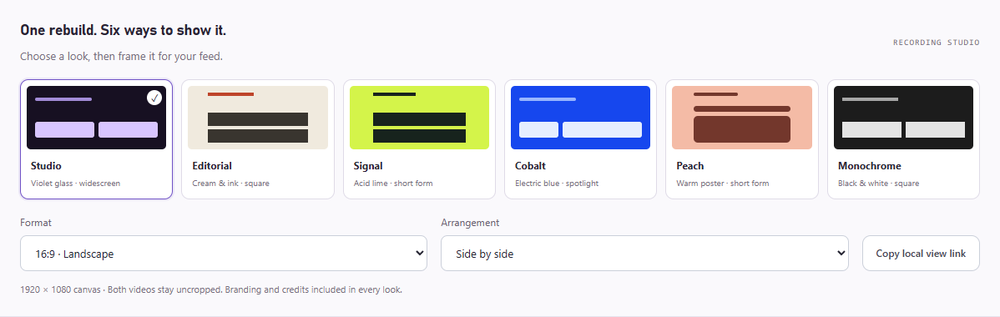

# Recording and exports

[Back to the README](../README.md)

For promotional comparisons, open a saved project and select **Compare & export**. **Fullscreen** opens the fullscreen layout with **motionclone.lol**, **@waselyyy**, and large **Before / AI generated** labels above synchronized videos. Space pauses or plays, R restarts, and Esc returns to the workspace; both videos loop together. **Download MP4** renders the selected canvas directly. A local project URL can include `&view=compare&record=1`.

The comparison keeps the videos prominent, with a single website link and creator handle. The AI result has a contrasting label. There are no slogans, repository links, or animated backgrounds. Run `.venv\Scripts\python.exe scripts/promo_comparison_acceptance.py --project YOUR_PROJECT_ID` to check saved media, recording layouts, and playback.

### Recording looks and short-form framing

In **Compare & export**, expand **Choose a style** to see the six looks. **Fullscreen** opens the recording view:

| Look | Default framing | Treatment |
|---|---|---|
| Studio | 16:9, side by side | Ice blue, dark type, blue result label |
| Editorial | 1:1, stacked | Cream paper and a rust result label |
| Signal | 9:16, stacked | Lime and dark ink |
| Cobalt | 16:9, rebuild spotlight | Blue and white with a smaller reference |
| Peach | 9:16, rebuild spotlight | Soft peach and warm brown |
| Monochrome | 1:1, side by side | Charcoal and white |

Every look retains motionclone.lol, both labeled videos, and @waselyyy. Format and arrangement can be changed independently. The canvases are 1920 x 1080, 1080 x 1920, or 1080 x 1080 and fit the available screen without cropping either video. Vertical canvases leave extra top and bottom space. Download MP4 uses the selected native dimensions regardless of your display size.

**Copy local view link** saves the look, format, and arrangement in a URL that opens directly into recording view on this computer. Preferences also persist in this browser. Example: `/?project=YOUR_PROJECT_ID&view=compare&record=1&look=signal&format=portrait&layout=stack`.

**Download MP4** exports this complete branded recording view from the first frame to the last, with original audio even when preview playback is muted. The selected look, format, and arrangement are frozen when the download starts. Export progress appears below the button; unchanged exports are reused. **Export details > Rebuilt video only** downloads the unframed reconstruction. Escape returns to the controls; Space toggles playback and R restarts both videos.

Run `.venv\Scripts\python.exe scripts/recording_presets_acceptance.py --project YOUR_PROJECT_ID` to check all 18 look/format combinations, playback sync, uncropped media, keyboard controls, local links, saved preferences, clipboard fallback, and narrow layouts. These checks use saved media and never start AI jobs.

Run `.venv\Scripts\python.exe scripts/recording_export_acceptance.py --project YOUR_PROJECT_ID` on a completed clip with audio to check the actual Download MP4 button, full recording export, original audio preservation, and repeat downloads from cache. Optional `--look`, `--format`, and `--layout` select another recording design. The first export takes several minutes; progress is shown in the page.

The HyperFrames ZIP contains composition data/code, required local assets, fonts/audio, and verification. Source video and reference screenshots are excluded. Extract it, run `npm install`, then `npm run preview` or `npm run render`. For generated projects, edit `project.json` and run `npm run sync` before external tooling reads `project.js`.

A **full archive** also includes the original reference and app code for local comparison. Keep that distinction in mind when sharing an archive.

New jobs use HyperFrames. Legacy projects retain their original exporters and are labeled accordingly; optional legacy Remotion rendering requires `npm ci --prefix remotion`.
